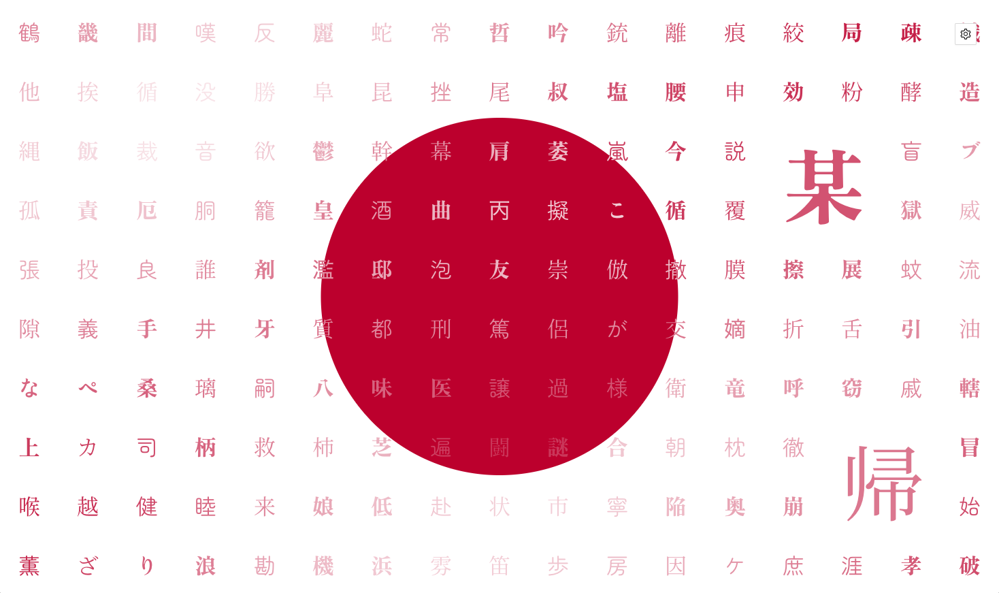

# Wall of kanji

Love Japan, China or Korea and always wanted to create your unique wallpaper or poster to reflect that love? Well, now you can!

## How?
1. Visit [wall-of-kanji.netlify.app](https://wall-of-kanji.netlify.app/)
1. Select which dataset you would like to use (this affects colors and set of used characters)
1. Change any settings if neccessary (they can be found under cog icon on right top corner)
1. If you don't like the result just hit the 'Regenerate' button
1. Hit 'Save HiRes' button and you're good to go

If you feel a bit adventerous, you can toggle animtion on.  This feature is kinda experimental and unoptimized and might load your grapic card a lot!

## Feedback

I'm happy to hear feedback from you! If you have anything to say, please create new issue [here](https://github.com/OlegWock/wall-of-kanji/issues).

## If you like this project...
... hit that star button or post message about how you like it on your social media. If you decide to print image generated by this app, I'd love to see a picture of it hanging on your wall (or wherever you put it).

Pull requests are also extremely welcomed!